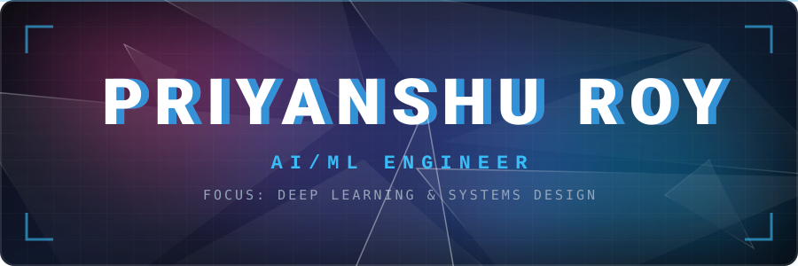

  

  
  
  

  

## ◈ Operational Directives

<table>
<tr>
<td width="50%" valign="top" align="center">

 
<code>[ MODULE_01 ]</code> <b>INTELLIGENCE ARCHITECTURE</b>  
<i>Parameter-efficient tuning • Zero-parameter compression • Continuous autonomous adaptation</i> 

</td>
<td width="50%" valign="top" align="center">

 
<code>[ MODULE_02 ]</code> <b>DISTRIBUTED TOPOLOGIES</b>  
<i>Zero-trust IPC pipelines • Decentralized swarms • Hardware-aware computational routing</i> 

</td>
</tr>
<tr>
<td width="50%" valign="top" align="center">

 
<code>[ MODULE_03 ]</code> <b>CONTEXTUAL SYNTHESIS</b>  
<i>AST-aware knowledge graphs • Structural retrieval algorithms • Vision-language forensics</i> 

</td>
<td width="50%" valign="top" align="center">

 
<code>[ MODULE_04 ]</code> <b>BARE-METAL OPTIMIZATION</b>  
<i>Kernel execution bridging • Cryptographic isolation • Dynamic memory taxation</i> 

</td>
</tr>
</table>

  

## ◈ Technical Ecosystem

 
<h4 align="center">AI & Modeling</h4>
 

   &nbsp;&nbsp;
   &nbsp;&nbsp;
   &nbsp;&nbsp;
   

 
<h4 align="center">Systems & Core Logic</h4>
 

   &nbsp;&nbsp;
   &nbsp;&nbsp;
   &nbsp;&nbsp;
   &nbsp;&nbsp;

 
<h4 align="center">Hardware Acceleration & Infrastructure</h4>
 

   &nbsp;&nbsp;
   &nbsp;&nbsp;
   &nbsp;&nbsp;
   &nbsp;&nbsp;
   

  

## ◈ System Telemetry

 

 

  

### ▎Live Operations Log

<code>▓▒░ SYNCHRONIZING RECENT COMMITS ░▒▓</code>

 

<!--START_SECTION:activity-->
<!--END_SECTION:activity-->

  

## ◈ Connect & Collaborate

  

  

  

 

<i>Open to technical collaborations and AI research opportunities.</i>

