  

  
  
  

  

## ◈ Professional Summary & Core Competencies

I am an AI Researcher and Systems Architect focused on engineering secure, high-performance computational infrastructure. My research and development prioritize hardware-aware execution, privacy-preserving deployment models, and mathematically verified stability for production-scale machine learning pipelines.

 

<table width="100%">
  <tr>
    <td width="50%" align="center" valign="top">
       
      <b>[01] ML Infrastructure & Acceleration</b> 
      Architecting low-latency SLM/LLM runtimes, parameter-efficient tuning pipelines, and hardware-aware quantization for high-throughput deployment.
        
    </td>
    <td width="50%" align="center" valign="top">
       
      <b>[02] Security & Privacy-First Architectures</b> 
      Enforcing zero-remote inference boundaries, cryptographic workload isolation, and deterministic schema-constrained generation.
        
    </td>
  </tr>
  <tr>
    <td width="50%" align="center" valign="top">
       
      <b>[03] Autonomous Systems & Agentic RAG</b> 
      Engineering multi-agent coordination frameworks, fault-tolerant state orchestration, and AST-aware code intelligence topologies.
        
    </td>
    <td width="50%" align="center" valign="top">
       
      <b>[04] Continuous Control & Simulation</b> 
      Developing adversarial skill learning algorithms, mixture-of-experts architectures, and physics-constrained kinematic simulations.
        
    </td>
  </tr>
</table>

  

## ◈ Technical Arsenal

 
<h4 align="center">Deep Learning & Neural Architectures</h4>
 

   &nbsp;&nbsp;
   &nbsp;&nbsp;
   &nbsp;&nbsp;
  

 
<h4 align="center">AI Research & Generative Systems</h4>
 

   &nbsp;&nbsp;
   &nbsp;&nbsp;
   &nbsp;&nbsp;
   &nbsp;&nbsp;
  

 
<h4 align="center">Systems & Core Compute</h4>
 

   &nbsp;&nbsp;
   &nbsp;&nbsp;
   &nbsp;&nbsp;
  

 
<h4 align="center">Infrastructure & Distributed Storage</h4>
 

   &nbsp;&nbsp;
   &nbsp;&nbsp;
   &nbsp;&nbsp;
   &nbsp;&nbsp;
  

  

## ◈ GitHub Analytics

 

  
<code>▓▒░ [ ACTIVITY MATRIX ] ░▒▓</code>
  

  

### ▎Recent Contributions

<!--START_SECTION:activity-->
<!--END_SECTION:activity-->

  

## ◈ Contact & Links

  

  

<i>Open to opportunities in ML Infrastructure, Applied AI Research, and Systems Engineering.</i>

